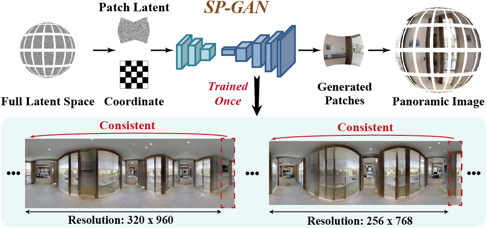

# Spherical Patch Generative Adversarial Net for Unconditional Panoramic Image Generation

This is the official repository for the papar 'Spherical Patch Generative Adversarial Net for Unconditional Panoramic Image Generation' in IEEE Transactions on Image Processing (TIP) 2025.

- [Paper](https://ieeexplore.ieee.org/document/11037336)

- Framework and Network architecture.



## 1. Environmets
```sh
conda env create -f configs/env/environment.yml
```

## 2. Data Prepare
Download the matterport3D dataset from "https://niessner.github.io/Matterport/"

Run the following command to get panoramic images for training.
```sh
python gen_pano_dataset.py
```

Run the following command to construct the lmdb database for training and testing.

## 3. Pre-trained Weights

Get the pretrained weights from "https://drive.google.com/file/d/1pNZbIyBcSrfQZv3Hr_whzkGOAp72S-fY/view?usp=drive_link"

Download the 'SP-GAN.ckpt' and put it at 'weights/SP-GAN.ckpt'.

## 4. Training

```sh
python train.py configs/model/spgan.yaml
```

## 5. Testing

```sh
CUDA_VISIBLE_DEVICES=0 python test.py --model-config configs/model/spgan.yaml --test-config configs/test/spgan_384x768.yaml --ckpt weights/SP-GAN.ckpt
```

## 6. Citation
Comming soon!
<!-- ```bibtex
@ARTICLE{11037336,
  author={Xu, Mai and Sun, Xiancheng and Li, Shengxi and Jiang, Lai and Xia, Jingyuan and Deng, Xin},
  journal={IEEE Transactions on Image Processing}, 
  title={Spherical Patch Generative Adversarial Net for Unconditional Panoramic Image Generation}, 
  year={2025},
  doi={10.1109/TIP.2025.3578257}}
``` -->
